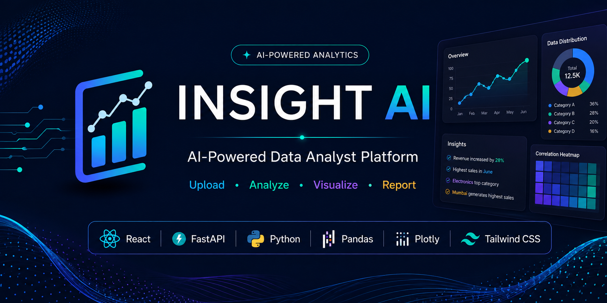
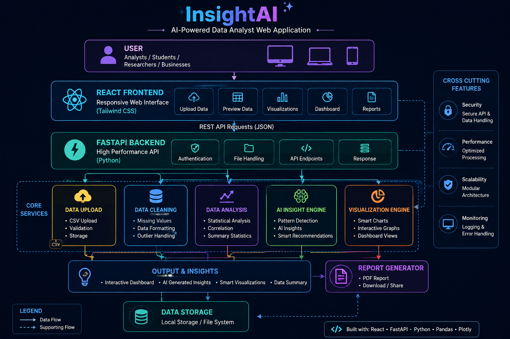

<p align="center">
  
</p>

<p align="center">


</p>

<h1 align="center">🚀 InsightAI</h1>

<p align="center">
AI-Powered Data Analyst Web Application
</p>

<p align="center">
Upload • Analyze • Visualize • Report
</p>

---

## 📖 Overview

InsightAI is an AI-powered web application designed to simplify data analysis. Users can upload datasets, automatically analyze data quality, generate intelligent insights, recommend suitable visualizations, and explore interactive dashboards.

This project aims to make data analysis easier for students, researchers, analysts, and businesses by combining modern web technologies with AI-powered analytics.

---

## ✨ Current Features

- 📂 Upload CSV datasets
- 📊 Dataset preview
- 🎨 Modern responsive interface
- ⚡ FastAPI backend
- ⚛ React frontend
- 🔄 GitHub version control

---

## 🚧 Upcoming Features

- Automatic Data Profiling
- Missing Value Detection
- Outlier Detection
- AI-generated Insights
- Smart Visualization Recommendation
- Interactive Dashboard
- Correlation Analysis
- PDF Report Generation
- AI Data Analyst Assistant

---

## 🛠️ Tech Stack

| Frontend | Backend | Data & AI |
|-----------|----------|-----------|
| React | FastAPI | Pandas |
| Tailwind CSS | Python | NumPy |
| Axios | Uvicorn | Plotly |

---

## 🏗️ System Architecture

<p align="center">
  
</p>

## 📁 Project Structure

```text
InsightAI/
│
├── backend/
├── frontend/
├── docs/
│   ├── assets/
│   └── screenshots/
│
├── README.md
├── .gitignore
├── package.json
└── package-lock.json
```

---

## 🚀 Installation

### Clone Repository

```bash
git clone https://github.com/atharva-k-31/InsightAI.git
```

### Backend

```bash
cd InsightAI/backend

pip install -r requirements.txt

uvicorn main:app --reload
```

### Frontend

```bash
cd ../frontend

npm install

npm run dev
```

---

## 🎯 Roadmap

### Version 1 ✅

- Upload Dataset
- Responsive UI
- Project Setup

### Version 2

- Data Profiling

### Version 3

- AI Insights

### Version 4

- Smart Visualizations

### Version 5

- Interactive Dashboard

### Version 6

- PDF Report Generator

### Version 7

- AI Data Analyst Chat Assistant

---

## 🤝 Contributing

Contributions, suggestions, and feedback are welcome.

Fork the repository, create a new branch, and submit a pull request.

---


## 👨‍💻 Author

**Atharva Kalambe**

This project was built by Atharva Kalambe with the assistance of OpenAI's ChatGPT for brainstorming, implementation guidance, documentation, and code review.

GitHub:
https://github.com/atharva-k-31

LinkedIn:
www.linkedin.com/in/atharva-kalambe-1bb52b420
